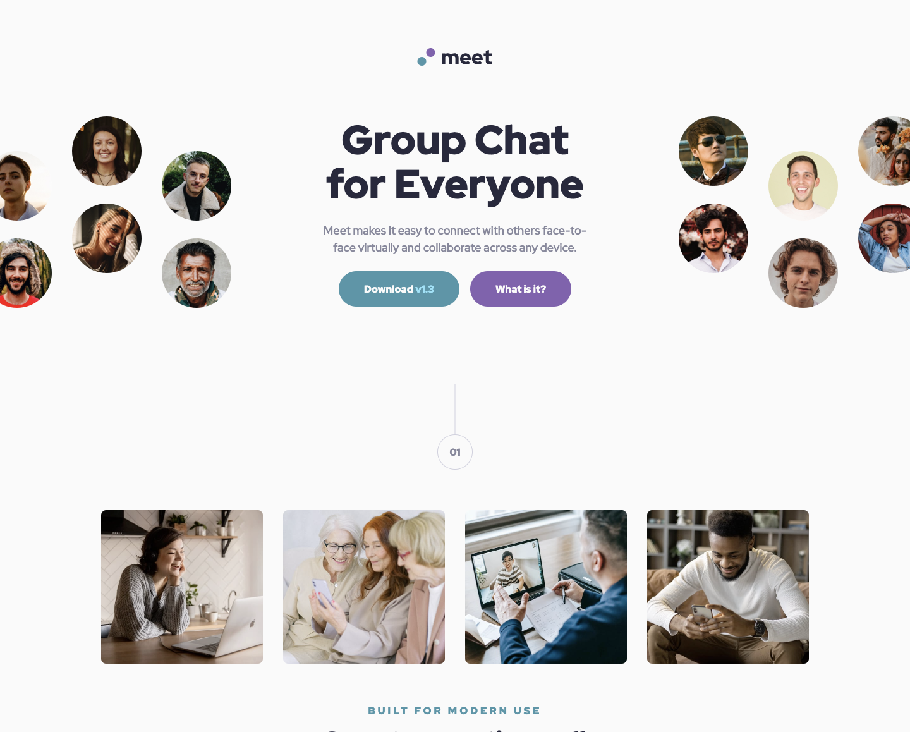
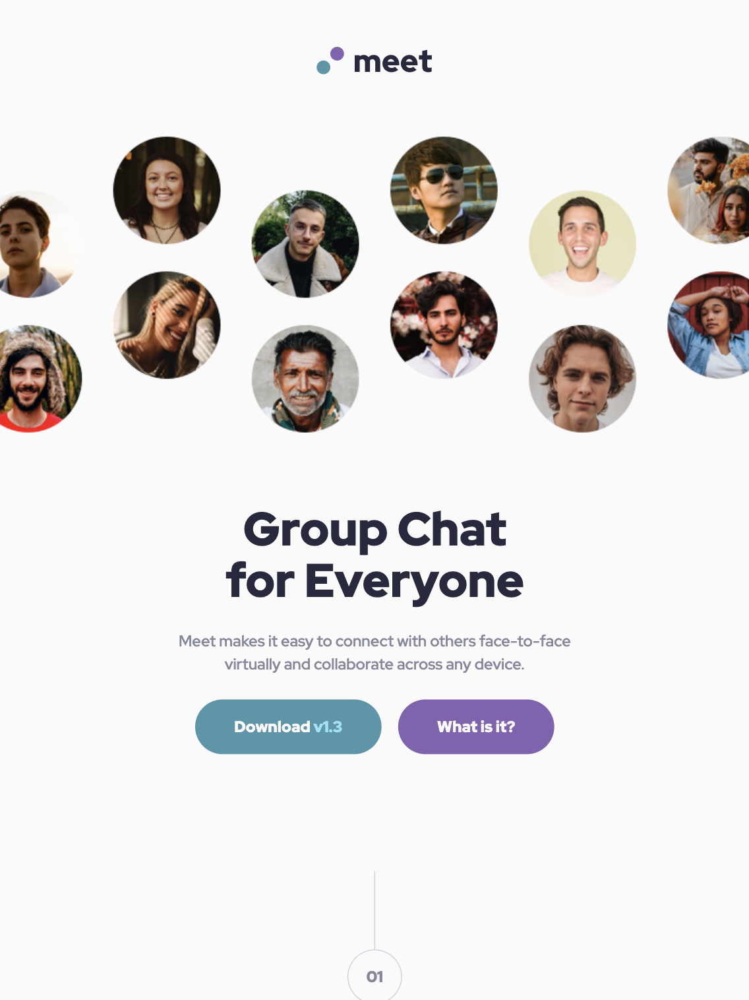
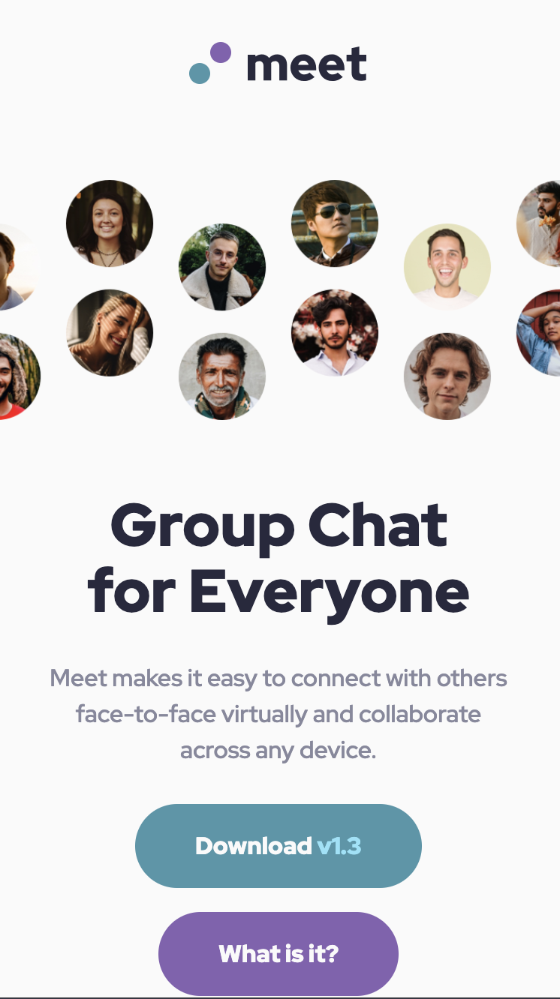

# Frontend Mentor - Meet landing page solution

## Table of contents

- [Overview](#overview)
  - [The challenge](#the-challenge)
  - [Screenshot](#screenshot)
  - [Links](#links)
- [My process](#my-process)
  - [Built with](#built-with)
- [Author](#author)

## Overview

### The challenge

Users should be able to:

- View the optimal layout depending on their device's screen size
- See hover states for interactive elements

### Screenshots

#### Desktop 

#### Tablet 

#### Mobile

### Links

- Solution URL: [Frontend Mentor](https://www.frontendmentor.io/learning-paths/building-responsive-layouts--z1qCXVqkD/steps/66aa80b2e2150da4c497dbfa/challenge/refactor)
- Live Site URL: [Demo](https://tusharmeetpage.netlify.app)

## My process

### Built with

- Semantic HTML5 markup
- Flexbox
- CSS Grid

## Author
- Frontend Mentor - [@petrihcour](https://tusharmeetpage.netlify.app)
